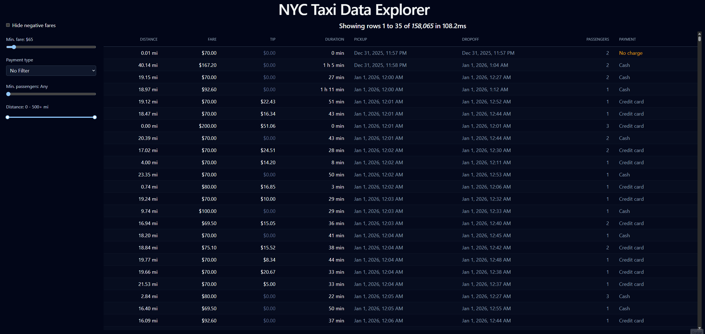

# NYC Taxi Data Explorer

A data explorer that shows 3.7 million NYC taxi trips from January 2026. All querying and filtering runs in the browser. No backend.


**[Live demo →](https://nyc-taxi-data-explorer.vercel.app/)**

## Example GIF



## Why This Is Hard

Rendering 3.7M rows in a browser hits three limits at once: download size, the worker-page boundary, and DOM size.
- **Download size**: A JSON with 3.7M rows would be much heavier than the Parquet (~480 MB as JSON vs ~25 MB as Parquet) and the browser would have to download it and parse it entirely in memory before showing anything.
- **Worker-page boundary**: The worker and the page don't share memory, so everything that the worker sends to the page is copied. In an early version sending the whole dataset took 17.2 s. Now it only sends the 500 rows that are going to be shown and the query takes 5-40 ms.
- **DOM size**: 3.7M elements in the page would block it. Virtualization (TanStack Virtual) fixes this by rendering only the visible rows.


## How It Works

- **Web worker + Comlink:** Allows the browser to execute the SQL queries (DuckDB) in another thread without freezing the interface. Comlink allows calling the worker as if they were normal async functions.
- **DuckDB-WASM:** An SQL engine that runs in the browser (WebAssembly). The filters become `WHERE` and each block of 500 rows a `LIMIT/OFFSET`, with a `COUNT(*)` with the same `WHERE` that gives the scrollbar the real total.
- **Parquet:** Columnar and compressed: DuckDB only reads the columns the SQL query asks. It's also split into row groups with the minimum and maximum of each column, and because the file is sorted by date, DuckDB can skip entire groups.
- **TanStack Virtual:** Renders only a few rows (20-30) even though there are 3.7M, in the DOM only those rows exist and a little margin while the scroll container keeps the height of the full list.

## Key Decisions

- **Optimized Parquet:** Initially the Parquet file was 61 MB, so I reduced it to 25 MB: reduced from 20 columns to 7 key columns, amounts converted to cents, zstd compression and sorted by date.
- **500-row blocks:** The rows are queried in fixed blocks while you scroll, so it only fires a query when you cross into a new block, instead of one per row scrolled.
- **HTTP range reads, measured and not merged:** Letting DuckDB download only the byte ranges it needs. First visit load reduced from 37 s to 15 s, but cached revisits went from 2.3 to 5.8 s. Plan: hybrid load.
- **Fixed row heights per breakpoint:** Measuring each row with `measureElement` was slow and left gaps when you scrolled fast. Every row has the same height per breakpoint (44 px on desktop, 360 px cards on mobile), so fixed sizes are faster and exact.
 
## Things I Got Wrong

Mistakes I made along the way and how I fixed them: 
- **Client-side filtering:** At first the filters only ran in JavaScript over the 90 rows that were already loaded. That only hid rows on screen but didn't filter the 3.7M. The scroll also kept using the total without filtering. I moved filtering into `WHERE` from SQL , with a filtered `COUNT(*)` .
- **One query per scrolled row:** The fetch window was recalculated from the visible rows, so every row you scrolled fired a new query. They would accumulate and when you stopped each old responses kept overwriting each other. I fixed it by implementing blocks of 500 rows each and discarding stale responses that arrive after a newer request.

## Known Limitations

- **Slow first load:** Before seeing any row the entire Parquet (25 MB) needs to be downloaded and the DuckDB engine (7 MB). With Fast 4G the first visit takes around 37 seconds, after that it only takes around 2 seconds thanks to the cache.
- **Scrollbar reach:** Chrome limits the height of an element to about 33.5 million pixels, so scrolling to the bottom only reaches the 760,000 row in desktop (93,000 in mobile). With filters the total amount is less and can be shown fully.
- **Deep pagination with filters:** With `LIMIT`/`OFFSET` DuckDB has to go through all of the previous rows that match the filter criteria. Without filters it takes around 45 ms at any depth, with a fare filter it takes about 21 ms near the top and around 250 ms to go to the bottom at row 760k.
- **Accessibility:** Only the basics so far. The virtual table isn't exposed as a table to the screen readers.
- **Outliers in the data:** There are some distances up to 269,097 miles. I left them like that to show the original dataset.  

## Tech Stack

React 19 · TypeScript · Vite · Tailwind CSS v4 · TanStack Virtual · Web Worker + Comlink · DuckDB-WASM · Vitest

## Running Locally

The dataset (`public/trips3.parquet`) is included in the repo.

```bash
pnpm install
pnpm dev     # start the dev server
pnpm test    # run the unit tests
```

## Data Source

[NYC TLC Trip Record Data](https://www.nyc.gov/site/tlc/about/tlc-trip-record-data.page), yellow taxi trips, January 2026. Reduced to 7 columns, amounts stored as integer cents and sorted by pickup time.

## Roadmap

- **Hybrid loading:** Takes a small portion using HTTP range reads of the Parquet that is shown first, and the full download in the background and cached. That way you don't have to wait until all the Parquet downloads to see some rows.
- **Scaled scrolling + keyset pagination:** Make the scroll element able to reach all of the 3.7M rows and fix the slower queries with filters.
- **Full accessibility:** Make the virtual table usable for screen readers keyboard nagivation.
- **Extract effects into custom hooks:** Improve the architecture separating effects from TripsTable into custom hooks.